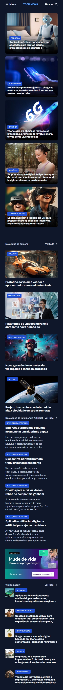
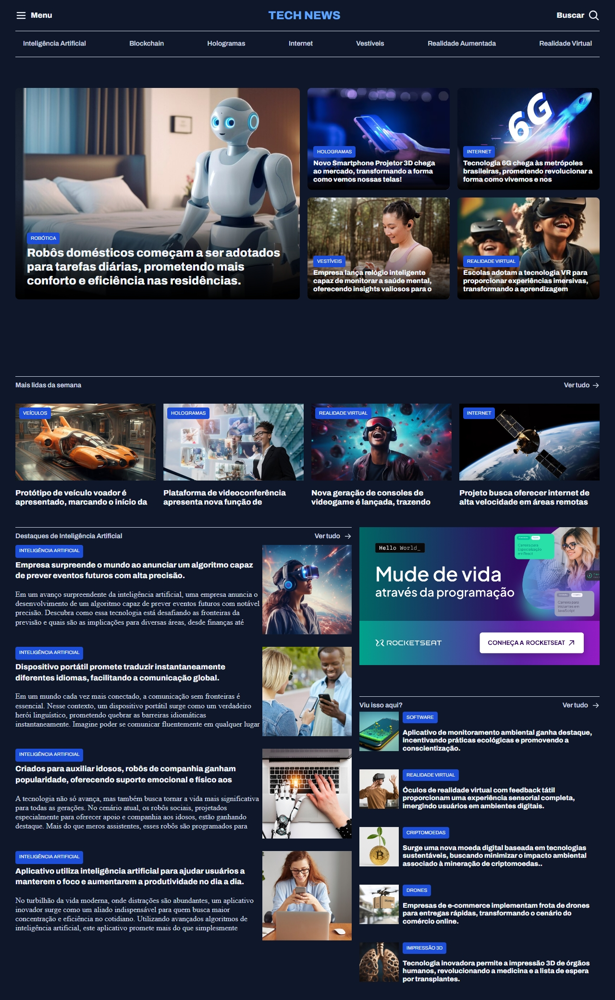

# 🌐 Tech News Portal
## 📋 Project
This repository showcases the development of a technology news portal using HTML and CSS. The main objective was to create a responsive and modern interface, utilizing CSS Grid for layout and adding hover effects and box shadows to enhance interactivity and user experience.

## 🛠️ Features
CSS Grid Layout: The portal's layout is structured using CSS Grid, allowing for efficient and responsive organization of elements across different screen sizes. This modular structure facilitates the arrangement of news articles and sections, creating a clean and organized appearance.

Hover Effects and Shadows: Each news card features hover effects and box-shadow to enhance interactivity and visually highlight elements when users hover over them. These effects provide a more engaging and sophisticated experience.

Navigation Menu: A responsive navigation menu is available at the top, allowing users to access various news categories, such as Artificial Intelligence, Blockchain, Holograms, and more.

Section Division: The portal is divided into multiple sections, including:

Main News: Highlights with large images and descriptions.
Most Read of the Week: A section with the most popular news articles.
Artificial Intelligence Highlights: A collection focused on AI news.
Did You See This?: A variety of news with an appealing visual approach.

   

## 💻 Technologies Used
HTML5: Semantic structuring of content.
CSS3: Utilization of CSS Grid for layout, box-shadow for shadows, and hover effects for interactivity.
Google Fonts: Custom typography to enhance visual appearance.

## 📈 Learning Experience
This project was an excellent opportunity to deepen my knowledge of CSS Grid and styling techniques with hover effects and shadows. The experience of developing a complete and responsive layout with enhanced interactions has better prepared me to create more complex and dynamic user interfaces.

## 📫 Contact
If you have any questions or suggestions about the project, feel free to reach out!

Email: luisvitorioguerra@hotmail.com
LinkedIn: José Guerra
I hope this project serves as inspiration and learning for those starting to explore the world of web development! 🚀